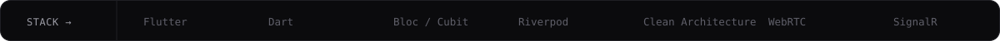
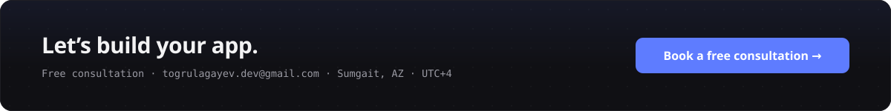

<!--
  Design system mirrors togrulagayev.com (dark #0B0B0D, accent #5E7CFF,
  Geist / Geist Mono). The SVGs in assets/ embed the fonts and animations —
  regenerate them from the portfolio repo if the copy changes.
-->

<div align="center">

<a href="https://togrulagayev.com">
  
</a>

<br/><br/>

<a href="https://github.com/togrulagayev">
  
</a>

<br/>

<a href="https://togrulagayev.com">
  
</a>
<a href="https://togrulagayev.com/assets/toghrul_aghayev_cv.pdf">
  
</a>
<a href="mailto:togrulagayev.dev@gmail.com">
  
</a>
<a href="https://www.linkedin.com/in/toghrulaghayev">
  
</a>

<br/><br/>


<br/><br/>



</div>

<br/>

## `// ABOUT`

```dart
class ToghrulAghayev extends CrossPlatformEngineer {
  final location = 'Azerbaijan 🇦🇿 · UTC+4';
  final email    = 'togrulagayev.dev@gmail.com';
  final website  = 'https://togrulagayev.com';

  final currentWork = [
    'TenderYard LLC — buy & sell marketplace   (06/2024 → now)',
    'YadEt — on-demand services platform       (01/2025 → now)',
  ];

  final focus = [
    'One codebase → iOS · Android · Web · Windows · macOS · Linux',
    'Real-time: WebRTC calls · SignalR chat · live streaming',
    'Clean Architecture · BLoC/Cubit · Riverpod',
    'Client-side encryption — AES-256-GCM · Argon2id',
  ];

  @override
  Future<App> build(Idea idea) async =>
      idea.toApp(fast: true, scalable: true, maintainable: true);
}
```

<div align="center">

| **1 codebase** | **4+ years** | **2 apps** | **Real-time** |
|:---:|:---:|:---:|:---:|
| six platforms — mobile · web · desktop | of Flutter experience | live on App Store & Google Play | chat · video calls · streaming |

</div>

<br/>

## `// SERVICES`

| | | |
|---|---|---|
| **📐 Cross-Platform Development**<br/>One app for mobile, web and desktop — less dev time, lower maintenance cost. | **🚀 MVP Development**<br/>Launch quickly and validate your idea with real users. | **🏢 Enterprise Applications**<br/>Internal tools, dashboards, CRM systems and management platforms. |
| **✨ AI-Powered Applications**<br/>AI chat, search, recommendations, image processing, automation. | **📡 Real-Time Applications**<br/>Messaging, voice/video calls, notifications, live updates. | **📈 Maintenance & Scaling**<br/>Feature development, bug fixing, performance, long-term support. |

## `// WHAT I BUILD`

<div align="center">


</div>

<br/>

## `// SELECTED WORK`

<table>
  <tr>
    <td width="50%" valign="top">
      <h3>🛒 TenderYard — Marketplace</h3>
      <p>Buy & sell marketplace built from scratch, in production with regular releases.</p>
      <ul>
        <li>→ 4-channel call system: WebRTC + SignalR + FCM + CallKit</li>
        <li>→ Reels feed: 10–15s start time → instant (controller pooling)</li>
        <li>→ Real-time chat: text, images, voice + chatbot</li>
      </ul>
      <a href="https://apps.apple.com/az/app/tenderyard/id6503719231"></a>
      <a href="https://play.google.com/store/apps/details?id=com.tenderyard.android.release&hl=en_US"></a>
    </td>
    <td width="50%" valign="top">
      <h3>🛠 YadEt — On-Demand Services</h3>
      <p>Service booking platform connecting customers with registered providers. 4 languages.</p>
      <ul>
        <li>→ 1-to-1 live video streaming with Agora RTC</li>
        <li>→ JWT auth + automatic token refresh (Dio interceptors)</li>
        <li>→ SignalR + FCM unified notification channel</li>
      </ul>
      <a href="https://apps.apple.com/us/app/yadet/id6758552096"></a>
      <a href="https://play.google.com/store/apps/details?id=com.yadet.android.release&hl=en_US"></a>
    </td>
  </tr>
  <tr>
    <td width="50%" valign="top">
      <h3>🔐 PassMate — Password Manager</h3>
      <p>Zero-knowledge password manager: the backend stores only ciphertext.</p>
      <ul>
        <li>→ Argon2id + AES-256-GCM, biometric unlock via OS keystore</li>
        <li>→ Riverpod 3 · go_router</li>
        <li>→ Mobile + Windows desktop</li>
      </ul>
      
    </td>
    <td width="50%" valign="top">
      <h3>🎮 Lingoes — Word Game</h3>
      <p>Wordle-style word game in 3 languages, fully offline.</p>
      <ul>
        <li>→ 5×5 / 6×6 / 7×7 modes with streak system</li>
        <li>→ Correct AZ/TR «i» case-folding</li>
        <li>→ Custom game engine · i18n · unit tests</li>
      </ul>
      
    </td>
  </tr>
</table>

<br/>

## `// EXPERIENCE`

| | Period | Role | Company |
|:---:|--------|------|---------|
| 🟢 | 01/2025 — now | Flutter Developer | YadEt |
| 🟢 | 06/2024 — now | Flutter Developer | TenderYard LLC |
| ⚪ | 01/2023 — 12/2024 | Flutter Developer & Instructor | Codelandia IT School |
| ⚪ | 05/2022 — 11/2022 | Flutter Developer | Freelance |
| ⚪ | 11/2021 — 03/2022 | Flutter Intern & Mentor | TechCamp |

<br/>

## `// STACK`

<div align="center">

**Frontend**


**Backend & Cloud**


**Real-Time & Media**


**Architecture & State**


**Platforms**


</div>

<br/>

## `// GITHUB`

<div align="center">


<br/><br/>


</div>

<br/>

## `// LANGUAGES`

<div align="center">


</div>

<br/>

<div align="center">

<a href="https://togrulagayev.com">
  
</a>

<br/><br/>

<sub>© 2026 Toghrul Aghayev · This README shares a design system with <a href="https://togrulagayev.com">togrulagayev.com</a></sub>

</div>
